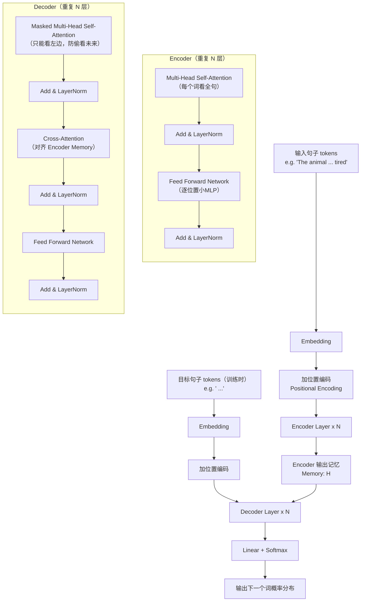
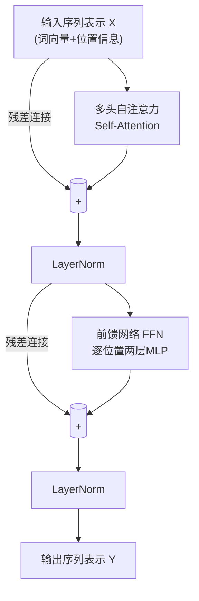
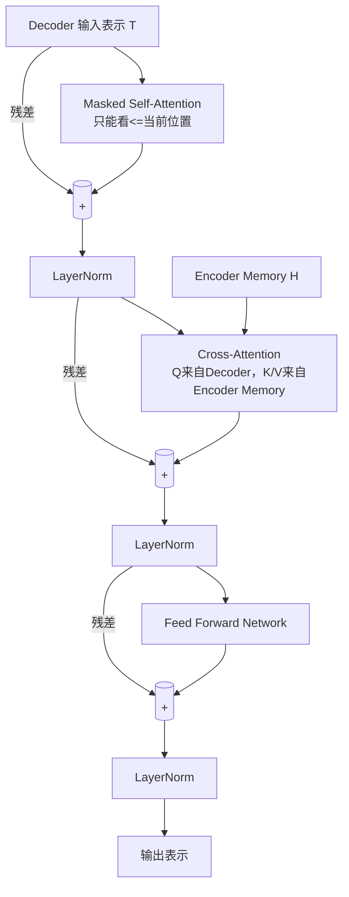
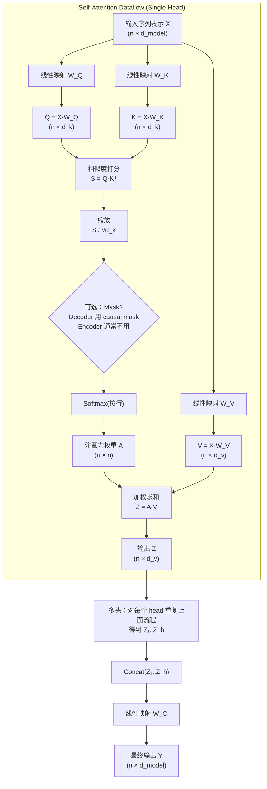
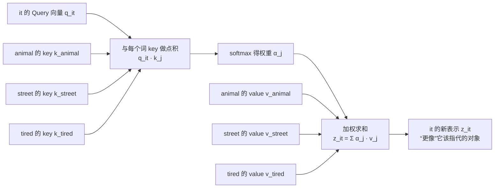

[to](https://chatgpt.com/c/6955dffc-81c4-8321-acbe-06b4ebd02067)
# 《Attention is all you need》 这篇论文讲诉了什么？
《Attention Is All You Need》（2017，Vaswani 等）这篇论文提出了 **Transformer**：一种**完全不依赖循环网络（RNN）和卷积（CNN）**、只用**注意力机制（attention）**就能做序列到序列任务（典型是机器翻译）的模型。论文的核心观点就是：**“注意力本身就足够”**，用它可以更快训练、并行更友好、效果也更好。

## 它解决了什么问题

在 Transformer 之前，机器翻译等序列任务主流是 RNN/LSTM/GRU（有时再加 attention）：

- **难并行**：RNN 需要按时间步顺序计算，训练慢。
    
- **长距离依赖困难**：序列很长时，信息传递容易衰减。  
    论文希望用一种结构，让模型：
    
- 能**全局**建模序列中任意两个位置的关系；
    
- 训练时能**高度并行**；
    
- 在翻译上达到/超过当时最强系统。
    

## Transformer 的关键设计

### 1) 自注意力（Self-Attention）

对序列里每个位置，计算它和其他位置的“相关性”，再加权汇总信息，从而让每个词能直接“看见”全句任何词。

论文使用的是 **Scaled Dot-Product Attention**：  

$$ \text{Attention}(Q,K,V)=\text{softmax}\left(\frac{QK^T}{\sqrt{d_k}}\right)V  $$

直觉：

- **Q**：我在找什么（query）
    
- **K**：我有哪些“索引”（key）
    
- **V**：对应的内容（value）
    
- 通过相似度给权重，再把信息加权求和。
    

### 2) 多头注意力（Multi-Head Attention）

不是只算一次注意力，而是并行算多个“头”，每个头在不同子空间里关注不同关系（例如语法依赖、指代关系、短语边界等），最后拼接起来。

### 3) 位置编码（Positional Encoding）

因为模型没有 RNN 的时间顺序结构，所以必须显式告诉模型“位置”。论文用**正弦/余弦**位置编码（也可以学习得到），把位置信息加到词向量上。

### 4) 编码器-解码器结构（Encoder–Decoder）

- **Encoder**：多层堆叠，每层包含
    
    - 自注意力（让句子内部互相对齐）
        
    - 前馈网络（逐位置的 MLP）
        
    - 残差连接 + LayerNorm
        
- **Decoder**：也堆叠多层，每层包含
    
    - **Masked** 自注意力（只能看见当前位置之前的词，保证自回归生成）
        
    - Encoder-Decoder Attention（对齐源语言与目标语言）
        
    - 前馈网络 + 残差 + LayerNorm
        

## 论文主要贡献/结论

- **提出 Transformer 架构**：抛弃 RNN/CNN，纯 attention 就能做 seq2seq。
    
- **训练更快、更并行**：自注意力可以一次处理整段序列（不像 RNN 逐步走）。
    
- **效果强**：在当时的机器翻译基准上取得很好的 BLEU 表现，同时训练成本更低/更快。
    
- **为后续大模型奠基**：后来的 BERT、GPT、T5 等几乎都建立在 Transformer 之上。
    

## 你可以怎么“用一句话理解”它

Transformer 用“**全局注意力**”在序列中建立任意位置的直接连接，再配合“**多头 + 位置编码 + 编码器/解码器堆叠**”，让模型既能捕捉复杂依赖，又能高效并行训练。

如果你愿意，我也可以按你的背景（初学/有深度学习基础/做 NLP）把它讲成更直观的例子，或者把 Encoder、Decoder 的数据流一步步画出来解释。

# 神经网络到Transformers的演化过程
可以把“从神经网络到 Transformer”的演变理解成：**我们一直在想办法更好地处理“序列”**（文本、语音、时间序列），并且让训练更快、能学到更远的依赖关系。

下面按“问题 → 解决办法 → 新问题”的方式带你走一遍主线。

---

## 1) 最早：普通神经网络（MLP）能做什么、不能做什么

**MLP（多层感知机）**擅长处理“固定长度”的输入：比如一张固定大小的图片、一组固定维度的特征。

但文本是序列：

- 句子长度不固定
    
- 单词顺序很重要
    
- 一个词的意义依赖上下文（尤其是很远的上下文）
    

你当然可以“把句子截断/补齐后拼成一个大向量塞给 MLP”，但会遇到：

- 参数爆炸（句子越长输入越大）
    
- 顺序信息难处理
    
- “远距离依赖”学不稳
    

于是出现了专门处理结构化数据的网络。

---

## 2) CNN：能并行、擅长局部模式，但长距离不够自然

**CNN（卷积网络）**本来用于图像，但也能用于文本（把句子当成一维信号）。  
它的特点：

- **局部感受野**：擅长抓 n-gram 局部模式（比如“非常 好”“不 太”）
    
- **可并行**：比 RNN 更好并行
    

问题：

- 要建模长距离关系，需要堆很多层或很大卷积核
    
- 句子里“第1个词”和“第20个词”的依赖，CNN得“绕很远”才能传到一起
    

所以在“序列建模”上，主角很快变成了 RNN 系列。

---

## 3) RNN：按时间一步步读，顺序建模自然，但训练慢、记忆远处困难

**RNN**的直觉非常符合语言：  
读到第 t 个词时，带着一个“隐藏状态” (h_t)，总结前面所有信息。

优点：

- 天然处理变长序列
    
- 顺序关系自然
    

但它也带来两大痛点：

1. **难并行**：必须按 t=1,2,3…顺序算
    
2. **长距离依赖困难**：梯度容易消失/爆炸，远处信息“记不住”
    

于是有了改良版：

### LSTM/GRU：更会“记忆”和“遗忘”

通过门控机制，缓解长距离依赖问题，但：

- 依旧顺序计算，训练仍慢
    
- 句子很长时依旧吃力
    

---

## 4) Seq2Seq：把“翻译/生成”做成编码器-解码器，但出现瓶颈

机器翻译是典型任务：输入一句英文，输出一句中文。

**Seq2Seq（Encoder-Decoder）**（早期常用 RNN/LSTM）：

- Encoder 把整句输入压到一个向量（“句子摘要”）
    
- Decoder 根据这个向量一个词一个词生成输出
    

问题：**信息瓶颈**  
整句被压缩成一个固定向量，长句特别容易丢信息。

这时出现了改变游戏规则的东西：**Attention（注意力）**。

---

## 5) Attention：不再只靠一个“摘要向量”，而是“随用随取”

注意力的直觉是：  
翻译输出每个词时，不要只看一个总体摘要，而是**去输入句子里“找相关的部分”**。

比如翻译到“苹果”，就重点看输入里对应“apple”的位置。

于是 Seq2Seq + Attention 解决了：

- 长句信息瓶颈
    
- 对齐（alignment）问题更自然
    
- 效果显著提升
    

但此时注意力通常还是“配菜”：RNN 仍是主体骨架。

---

## 6) Self-Attention：把“找相关部分”扩展到句子内部

前面注意力多用于 **decoder 去看 encoder（跨序列）**。  
而 **Self-Attention（自注意力）**是：**同一序列内部互相看**。

它回答的问题是：

- “这个词在这个句子里到底指什么？”（上下文决定）
    
- “哪个词跟它最相关？”（可能在很远处）
    

关键性质：

- 任意两个位置都能**直接建立联系**（一跳到位）
    
- 计算可以用矩阵乘法一次完成，**非常适合并行**
    

到这一步，你可能会问：  
“既然 self-attention 这么强，那我还要 RNN 干嘛？”  
Transformer 的答案是：**不要了。**

---

## 7) Transformer：把骨架从 RNN 换成“纯注意力 + 前馈网络”

Transformer 做了一个大胆决定：  
**完全去掉 RNN/CNN，只保留注意力作为核心交互机制。**

它由两块组成：

- **Encoder 堆叠 N 层**：每层 = 自注意力 + 前馈网络
    
- **Decoder 堆叠 N 层**：多了两点
    
    - **Masked self-attention**（生成时不能偷看未来）
        
    - **Cross-attention**（去看 encoder 输出，完成对齐）
        

还必须补上一个东西：**位置编码**  
因为注意力本身对“顺序”不敏感（把词打乱它也能算），所以要显式注入位置信息。

---

## 8) 为什么 Transformer 能赢：它解决了前面所有关键痛点

把主线痛点对照一下就很清晰：

- RNN：顺序计算 → **Transformer：并行计算**（训练快）
    
- RNN：远距离依赖难 → **自注意力：任意位置直接连接**
    
- Seq2Seq：固定向量瓶颈 → **注意力：按需读取全部输入**
    
- CNN：要多层才能看远处 → **注意力一层就能看全局**
    

代价也有：

- 自注意力对序列长度是 **(O(n^2))**（句子越长越吃显存/算力）
    
    - 这也是后来各种“长上下文优化”的研究方向
        

---

## 一个超直觉的类比（帮助你“感觉到”Transformer）

把一句话想成一场会议：

- RNN：主持人按顺序让每个人发言，后面的人只能记住主持人总结的要点（慢、容易漏）
    
- Attention：每次需要信息时，直接点名问相关的人（更准）
    
- Self-Attention：每个人发言前都能快速扫一眼全场，知道谁说过和自己相关的话（全局互动）
    
- Transformer：整个会议流程就围绕这种“快速互相引用”来组织（并行高效）

# 案例帮助理解

## 案例句子

> **The animal didn’t cross the street because it was too tired.**  
> 问：**it** 指的是谁？  
> 直觉上：**it = the animal**（动物太累了，所以没过马路）

如果换一句：

> **The animal didn’t cross the street because it was too wide.**  
> 这里 **it = the street**（路太宽了）

这类题的关键是：模型需要把 “it” 跟前面某个词建立联系，而且这个联系可能隔了不少词。

---

## 1) RNN 是怎么处理这个问题的（为什么会吃力）

RNN/LSTM 是按顺序读：

- 读到 _The animal ..._ 把“animal”的信息压进隐藏状态
    
- 一直读到最后的 _it_，希望隐藏状态还能保留“animal / street”等关键信息
    
- 但距离长、信息多时，隐藏状态会“挤”掉一些细节（更别说训练时的梯度传播问题）
    

它能学会，但**路径很长**：信息要一路通过 (h_1 \to h_2 \to ... \to h_t)。

---

## 2) Self-Attention 怎么做（核心直觉）

Self-Attention 的想法是：  
当我们在处理词 **it** 的表示时，不必只靠“前面总结的状态”，而是：

> 让 **it** 直接去“看一眼”句子里所有词，决定该更关注谁。

也就是：**it 对所有词分配注意力权重**，比如可能变成：

- 对 _animal_：0.55
    
- 对 _street_：0.10
    
- 对 _tired_：0.20
    
- 对其他词：剩下的
    

然后 it 的新表示就是这些词信息的加权和（更关注 animal，就更像“animal相关的it”）。

---

## 3) 用超小的“玩具数字”演示一次注意力（不需要你会线代）

我们只演示“it 在找谁”，用一个简化版，不纠结训练出来的参数怎么来——先看机制。

假设句子里只考虑 3 个候选词：

- **animal**
    
- **street**
    
- **tired**  
    以及当前词 **it**
    

Self-Attention 会给 “it” 生成一个 Query（Q），给每个候选词生成 Key（K）：

- Q(it)：表示“我现在要找什么样的信息”
    
- K(word)：表示“我是什么样的信息标签”
    

然后算相似度（点积）：

|it 的 Q 与谁的 K 更像？|相似度分数（假设）|
|---|--:|
|animal|2.0|
|street|0.2|
|tired|1.0|

把分数做 softmax 变成权重（大致会变成）：

- animal：**0.62**
    
- tired：**0.28**
    
- street：**0.10**
    

最后 it 的新向量 = 0.62*V(animal) + 0.28*V(tired) + 0.10*V(street)

这就实现了：**it 直接“拉取”animal 和 tired 的信息**，而不是靠一步步传递。

---

## 4) 多头注意力为什么更强（用一句话理解）

一个头可能专门学“指代关系”（it → animal / street）  
另一个头可能学“因果线索”（because → tired/wide）  
再一个头可能学“句法结构”（主语/宾语）

所以多个头一起看，模型更稳、更能解释复杂句子。

---

## 5) 从这个案例到 Transformer 架构：发生了什么质变？

到这一步，你已经有了 Transformer 的“骨架动机”：

- RNN：序列信息靠“链式记忆”
    
- Self-Attention：序列信息靠“全局检索”
    

于是 Transformer 选择：

1. 用 **Self-Attention** 作为每层的核心“信息交互”
    
2. 再加一个 **前馈网络（FFN）** 做非线性变换（每个位置独立的小 MLP）
    
3. 用 **残差 + LayerNorm** 保持训练稳定
    
4. 用 **位置编码** 补回“顺序感”
    

最终：编码器堆很多层，就会逐层学到越来越抽象的依赖关系。

---

## 你可以自己做的“迷你练习”

把句子换成两种结尾，判断 it 的注意力该偏向谁：

1. because it was **too tired** → it 偏向 **animal**
    
2. because it was **too wide** → it 偏向 **street**
    

然后你会发现：**注意力权重其实就像“软对齐/软指代”的概率分布**。'

# 流程图解

## 1) 整体：Transformer（Encoder–Decoder）流程图

---

## 2) 放大：Encoder 单层内部细节（你刚才那个“it 指代谁”的关键发生在这里）

> 解释一句：  
> 当模型处理 **“it”** 的位置时，Self-Attention 会给它分配对全句其它词的权重（更关注 animal 或 street），于是它的表示就“带上了”正确的指代信息。

---

## 3) 放大：Decoder 单层（为什么需要 Mask + 为什么还要 Cross-Attention）

---

## Q/K/V 的生成与注意力矩阵（softmax(QKᵀ)) 的数据流图

## it这个位置的局部视角

