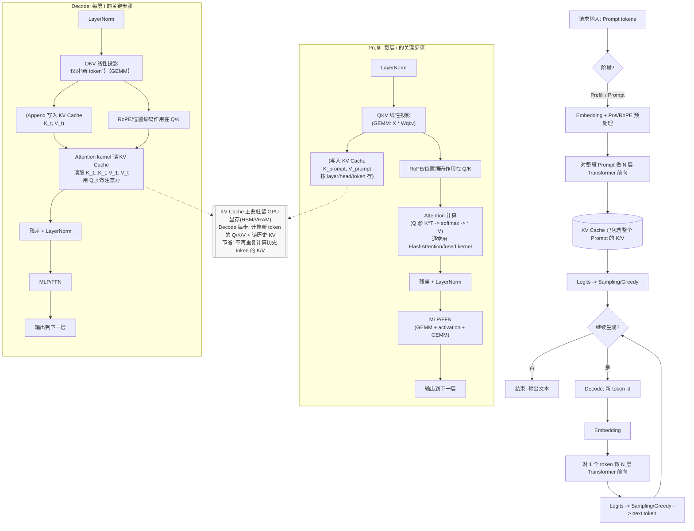

# KV Cache

在大模型（Transformer）推理里说的 **KV Cache**，本质上就是：**把“历史 token 在每一层自注意力里算出来的 Key / Value 结果存起来（缓存），后续生成新 token 时直接复用**，不用每一步都把整段上下文再算一遍。

下面按“它是什么 → 为什么需要 → 起什么作用 → 代价与工程细节”讲清楚。

---

## 1) KV Cache 是什么（K/V 缓存的内容）

以一层自注意力为例：

- 对输入序列每个 token，会算出三组向量：**Q（Query）/ K（Key）/ V（Value）**
    
- 生成第 _t_ 个 token 时，需要让这个新 token 的 **Qₜ** 去和 **所有历史 token 的 K₁..Kₜ** 做注意力打分，然后用分数加权汇总 **V₁..Vₜ**
    

**KV Cache 缓存的就是：每一层、每个头（head）、每个历史 token 的 K 和 V。**  
也就是说它是一个跨 token 逐步增长的张量（每生成一个新 token，就把该 token 的 K/V append 到缓存里）。

---

## 2) 为什么需要 KV Cache（不缓存会发生什么）

LLM 的生成是自回归的：一次生成一个 token。

如果没有 KV Cache，那么你在生成第 _t_ 个 token 时，为了得到注意力所需的 K/V，你得把长度为 _t_ 的整段上下文在每一层重新跑一遍，重新产生 **K₁..Kₜ、V₁..Vₜ**。

这会导致**大量重复计算**：上一步已经算过的历史 token 的 K/V，下一步又再算一次。

---

## 3) KV Cache 能起到什么作用（核心收益）

### 作用 A：把“每步生成”的重复计算砍掉

有了 KV Cache：

- 每一步只需要对“新 token”算一次 K/V（以及各层的中间计算）
    
- 历史 token 的 K/V 直接从缓存读出来
    

**结果：生成阶段的算力开销大幅下降，延迟更低、吞吐更高。**  
（尤其是长上下文 + 长输出时差距非常明显。）

### 作用 B：让推理更“GPU 友好”

在 NVIDIA GPU 上，推理性能很多时候不只看 FLOPs，还看：

- 显存带宽
    
- 内存访问是否连续、是否能合并读写
    
- kernel 是否融合（fused）减少 launch 开销
    

KV Cache 让推理从“反复算历史”变成“主要读历史 KV + 算新 token”，这更符合现代推理 kernel 的优化方向（比如各类注意力 kernel、FlashAttention / paged attention 思路等）。

### 作用 C：服务端场景里的关键能力

在 LLM serving（多用户并发）里，KV Cache 还带来：

- **prefix caching（前缀复用）**：多个请求共享相同系统提示词/长前缀时，可复用对应前缀的 KV（取决于框架支持）
    
- **beam search / speculative decoding** 等策略更容易组织（缓存可复制/分叉/回滚）
    

---

## 4) 但它不是“免费”的：KV Cache 的代价

### 代价 1：显存占用很大（最主要的瓶颈）

KV Cache 通常存放在 GPU 显存（VRAM/HBM）中，因为读取频繁、放 CPU 会慢很多。

缓存大小随下面因素线性增长：

- batch size（并发请求数）
    
- sequence length（上下文长度 + 已生成长度）
    
- layer 数
    
- hidden size、head 数
    
- K/V 的数据精度（FP16/BF16/FP8/INT8 等）
    

所以你会看到：**很多时候模型明明算得动，但“上下文一长就爆显存”——爆的就是 KV Cache。**

### 代价 2：注意力仍然要“看全历史”

KV Cache 解决的是“重复算 K/V”的问题，但每生成一个 token，仍然要做一次：

- **Qₜ × K₁..Kₜ 的注意力打分**
    
- 对 V₁..Vₜ 的加权汇总
    

也就是：**每步生成的注意力开销仍随上下文长度增长（大体 O(t)）**。  
KV Cache 让它从“更糟的重复计算”变成“主要是读缓存 + 做必要的注意力”。

### 代价 3：带宽/碎片化问题

大规模并发时，KV Cache 读写会吃掉大量显存带宽；同时不同请求长度不同会带来内存碎片。工程上常见应对：

- **Paged / Block KV Cache**（按页管理，减少碎片）
    
- KV 压缩/量化（FP16→FP8/INT8）
    
- cache offload（部分放 CPU 或 NVMe，换显存但会增加延迟）
    

---

## 5) 用一句话总结

**KV Cache = 把历史 token 在每层注意力里的 K/V 存在 GPU 显存里复用。**  
它的作用是 **显著减少自回归生成时的重复计算，提高吞吐并降低延迟**；代价是 **显存占用大、带宽压力大，长上下文时尤其明显**。

# 在线推理如何优化
在线推理服务里，KV Cache 的优化基本就围绕两件事：

1. **让 KV Cache 更省显存、更少碎片、更容易调度**（否则并发一上来就 OOM）
    
2. **让“读/写 KV Cache + 注意力计算”的路径更高吞吐**（否则延迟和 TPOT/吞吐上不去）
    

下面按“你在搭建服务时能直接落地的手段”给一套实战清单。

---

## 1) 先做对：用“分页/块化 KV Cache”避免碎片和浪费

**核心思路：别按“每个请求一整块连续显存”去分配 KV**，而是把 KV Cache 切成固定大小的 block/page，由 allocator 动态分配、回收、复用。

- vLLM 的 **PagedAttention** 就是为“paged KV cache”设计的注意力与内存管理方案，目标是减少浪费/碎片并支持高效复用与调度。([vLLM](https://docs.vllm.ai/en/stable/design/paged_attention/?utm_source=chatgpt.com "Paged Attention - vLLM"))
    
- TensorRT-LLM 也把 **Paged KV cache** 作为 KV 管理的重要能力，并配套批处理/调度能力。([nvidia.github.io](https://nvidia.github.io/TensorRT-LLM/overview.html?utm_source=chatgpt.com "Overview — TensorRT LLM"))
    

**收益**

- 并发请求长度不一时，显存不会被大量“填不满的尾巴”浪费
    
- 更容易做请求抢占/终止/回收，不会触发大规模 memcopy
    

**落地建议**

- 如果你用 vLLM / TensorRT-LLM / 类似引擎：优先启用/使用它们的 paged KV cache（不要自己从头造轮子）
    
- 监控指标要看“free KV blocks / used blocks / block miss/OOM”等（TensorRT-LLM 的 batch manager 文档就会打印类似统计项）。([GitHub](https://github.com/nyunAI/TensorRT-LLM/blob/main/docs/source/batch_manager.md?utm_source=chatgpt.com "TensorRT-LLM/docs/source/batch_manager.md at main"))
    

---

## 2) 配合“连续批处理/动态批处理”，把 KV cache 当成调度的第一约束

在线服务的吞吐，多数不是被算力打满，而是被 **KV cache 容量 + 带宽** 卡死。

- TensorRT-LLM 把 **in-flight batching（continuous batching）** 和 KV cache 管理放在一起讲，这是典型生产配置方向。([NVIDIA Developer](https://developer.nvidia.com/blog/nvidia-tensorrt-llm-now-accelerates-encoder-decoder-models-with-in-flight-batching/?utm_source=chatgpt.com "NVIDIA TensorRT-LLM Now Accelerates Encoder-Decoder ..."))
    
- vLLM 也提供一堆直接影响 KV cache 占用的参数（比如预留多少显存做 KV cache、batch token 上限、并发序列上限）。([vLLM](https://docs.vllm.ai/en/stable/configuration/optimization/?utm_source=chatgpt.com "Optimization and Tuning - vLLM"))
    

**怎么调更“工程化”**

- 用 **token 预算** 而不是“请求数预算”来做 admission control
    
    - 例如限制 `max_num_batched_tokens` / `max_num_seqs` 这类参数（不同框架名字不同），核心就是：让调度器保证 KV 不会爆。
        
- 把请求分层：短请求优先、长请求限流（长上下文会线性吃 KV）
    
- “尾部长输出”很贵：对可控场景设 `max_new_tokens` 上限，或引导用户用流式输出+截断策略
    

---

## 3) Prefill 太长？上 “Chunked Prefill / 分块预填充”

长 prompt 的 prefill 会瞬间吞掉大量显存峰值，同时也会让单次 prefill kernel 时间很长、影响 P99。

- TensorRT-LLM 把 **Chunked Prefill** 作为处理长序列的重要能力之一。([nvidia.github.io](https://nvidia.github.io/TensorRT-LLM/overview.html?utm_source=chatgpt.com "Overview — TensorRT LLM"))
    

**实践要点**

- 把超长 prompt 切成多个 chunk 逐段 prefill（引擎支持的话直接开；不支持则考虑换引擎/升级）
    
- 对“检索增强 RAG”这种天然长上下文：尽量做 prompt 压缩/去重（不然 KV cache 的成本会持续拖垮吞吐）
    

---

## 4) 想显存立刻变大：KV Cache 量化（FP8 / INT8 等）

KV cache 往往是显存大头，**量化 KV** 通常是“最直接的并发提升旋钮”。

- vLLM 明确提供 **Quantized KV Cache**（例如 FP8 E4M3）并说明对准确率影响通常较小、可用于吞吐优化。([vLLM](https://docs.vllm.ai/en/latest/features/quantization/quantized_kvcache/?utm_source=chatgpt.com "Quantized KV Cache - vLLM"))
    
- 一些基准与工程实践也会把 **KV cache 的 INT8** 作为重要的性能配置项来对比（尤其在不同 GPU/精度模式下）。([Databricks](https://www.databricks.com/blog/serving-quantized-llms-nvidia-h100-tensor-core-gpus?utm_source=chatgpt.com "Serving Quantized LLMs on NVIDIA H100 Tensor Core GPUs"))
    

**注意 trade-off**

- KV 量化会影响注意力数值精度：一般 FP8 风险小于更激进的低比特
    
- 对特定模型/任务要做 A/B（尤其是长上下文、工具调用、代码任务）
    

---

## 5) 省“重复 prefill”：前缀复用 / Prefix KV Cache（共享系统提示词）

如果你的服务里系统提示词很长、模板固定（企业 agent、客服、RAG pipeline 常见），**前缀复用**能省掉大量 prefill 计算与 KV 写入。

两条典型路线：

- **vLLM 的 block 级缓存 + 自动/手动前缀缓存思路**（实现细节随版本变化，理念是“相同 token 前缀命中则复用对应 KV block”）([Runpod](https://www.runpod.io/blog/introduction-to-vllm-and-pagedattention?utm_source=chatgpt.com "Introduction to vLLM and PagedAttention"))
    
- **SGLang 的 RadixAttention**：用前缀树（radix tree）管理 KV cache，实现“最长前缀命中 + 只算 suffix”。([LMSYS](https://lmsys.org/blog/2024-01-17-sglang/?utm_source=chatgpt.com "Fast and Expressive LLM Inference with RadixAttention ..."))
    

**什么时候最值**

- Prompt 模板化程度高（system + instructions 固定）
    
- 多轮对话里“共同前缀”很长
    
- RAG 里固定的检索指令段很长
    

**落地提醒**

- 前缀命中要求“token 序列一致”（空格、标点、模板变量都会影响 tokenization）
    
- 需要配套 eviction 策略（LRU/TTL/按成本）和命中率监控，否则容易“缓存占满但命中低”
    

---

## 6) 真的放不下：分层/外溢 KV（GPU→CPU→远端缓存）

如果你追求极高并发或多机共享前缀缓存，可以做 KV 分层：

- 有方案描述了 vLLM 的“分层 KV caching”：先查 GPU blocks，miss 再到 CPU，甚至再到外部 KV connector（如对象存储/分布式缓存）。([Ceph](https://ceph.io/en/news/blog/2025/vllm-kv-caching/?utm_source=chatgpt.com "KV Caching with vLLM, LMCache, and Ceph"))
    

**适用场景**

- 很多请求共享长前缀（命中高），但 GPU 容量不够把所有热前缀都常驻
    
- 可以容忍“缓存 miss 时更高的延迟”（因为 offload/远端拉取一定慢）
    

---

## 7) 一套“上线就用得上”的监控与调参顺序

**关键指标（建议都打出来）**

- KV blocks：used / free / evicted / hit-rate（如果有前缀缓存）
    
- OOM/拒绝率：admission control 拒绝了多少请求、原因是什么
    
- TPOT（time-per-output-token）分位数：P50/P95/P99
    
- Prefill latency vs Decode latency：看瓶颈在 prefill 还是 decode
    

**推荐调参顺序（最常见有效路径）**

1. 开 paged KV cache（或换到支持它的引擎）([vLLM](https://docs.vllm.ai/en/stable/design/paged_attention/?utm_source=chatgpt.com "Paged Attention - vLLM"))
    
2. 开 continuous batching，并用 token budget 控并发 ([NVIDIA Developer](https://developer.nvidia.com/blog/nvidia-tensorrt-llm-now-accelerates-encoder-decoder-models-with-in-flight-batching/?utm_source=chatgpt.com "NVIDIA TensorRT-LLM Now Accelerates Encoder-Decoder ..."))
    
3. 长 prompt 上 chunked prefill ([nvidia.github.io](https://nvidia.github.io/TensorRT-LLM/overview.html?utm_source=chatgpt.com "Overview — TensorRT LLM"))
    
4. 仍然显存吃紧：上 KV cache 量化（先 FP8）([vLLM](https://docs.vllm.ai/en/latest/features/quantization/quantized_kvcache/?utm_source=chatgpt.com "Quantized KV Cache - vLLM"))
    
5. 模板化明显：上 prefix caching / RadixAttention ([LMSYS](https://lmsys.org/blog/2024-01-17-sglang/?utm_source=chatgpt.com "Fast and Expressive LLM Inference with RadixAttention ..."))
    
6. 追更高并发：考虑 KV 分层/外溢（明确延迟代价）([Ceph](https://ceph.io/en/news/blog/2025/vllm-kv-caching/?utm_source=chatgpt.com "KV Caching with vLLM, LMCache, and Ceph"))
