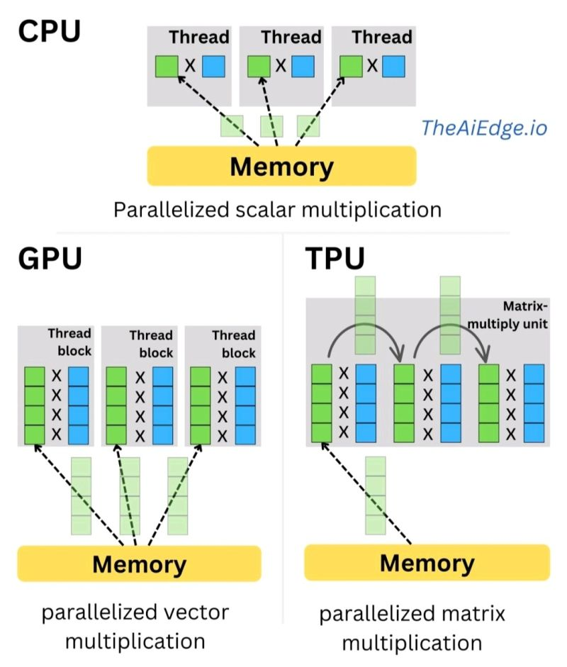

# 直接对比
TPU（Tensor Processing Unit）和 GPU（图形处理器）最大的区别：**它们面向的计算类型不同**——GPU 是通用的并行计算“多面手”，TPU 是为神经网络（尤其是矩阵乘法）“定制的专用加速器”。

## 1) 设计目标：通用 vs 专用

- **GPU**：最初为图形渲染而生，但后来发展成很强的通用并行计算平台（CUDA/ROCm 等），适合各种数值计算、仿真、渲染、科学计算、以及 AI 训练/推理。
    
- **TPU**：主要为深度学习工作负载设计，核心是把**大规模矩阵乘法/卷积**做得极快、能效更高（每瓦性能更好）。对“非深度学习”或不规则计算就没那么灵活。
    

## 2) 计算单元：SIMT 核心 vs 矩阵引擎

- **GPU**：大量通用计算核心（SIMT/SIMD 思路），也有 Tensor Core 之类的矩阵单元，但整体仍偏通用。
    
- **TPU**：通常以**矩阵乘法阵列（systolic array）**为核心，针对深度学习常见算子做了硬件级优化，因此在“矩阵密集型”的模型里很占优势。
    

## 3) 编程与生态：灵活度差异很大

- **GPU**生态成熟：PyTorch/TF/JAX 都支持；自定义算子、各种库（cuDNN、cutlass 等）丰富；本地机器、各家云都好用。
    
- **TPU**主要在 Google 生态里更顺：常见是 **JAX 或 TensorFlow**，也能用 PyTorch（通过 XLA/torch_xla），但“可玩性”和自定义底层算子的门槛通常更高。
    

## 4) 性能与性价比：看任务类型

- **训练大模型/大批量矩阵计算**：TPU 经常能做到**更高吞吐/更好能效**（尤其在 TPU Pod 这种规模化集群里）。
    
- **多样化模型、非标准算子、研究中频繁改结构**：GPU 往往更省心，因为兼容性、调试、工具链更成熟。
    
- **推理（Inference）**：两者都能做。TPU 在批量推理和能效上常有优势；GPU 在部署形态（各种卡、各种云、边缘设备）更灵活。
    

## 5) 精度与数据类型支持

两者都会用低精度来提速（如 FP16/BF16/INT8）。

- **TPU**常见对 **BF16** 支持很强，训练稳定性好、速度也快。
    
- **GPU**对 FP16、BF16、INT8 等也很强（尤其新一代卡），而且选择更多。

# 成本对比

> **如果你主要做 Transformer（训练 + 推理），并且能接受 GCP + JAX/TF（或 torch_xla）这一套环境，那么 TPU 在“单位算力成本 + 能效”上通常比 GPU 更省；但在“部署复杂度、工程灵活性、跨平台”上，GPU 明显更省心。**

下面将从**成本、训练、推理、部署复杂度**四个点来拆解。

---

## 一、纯算力成本：TPU 通常更便宜（但有前提）

### 1️⃣ 训练阶段（Transformer 是强项）

对 **标准 Transformer（Attention + MLP）** 来说：

- **TPU v4 / v5**
    
    - BF16 原生支持好
        
    - 大矩阵吞吐高
        
    - 通信（TPU Pod 内）效率高
        
- **同等规模下**（比如跑同尺寸 LLM）：
    
    - **TPU 的 $/TFLOP 通常低于 A100/H100**
        
    - 在 **大 batch、长时间训练** 时优势明显
        

👉 **结论**：  
**只要模型结构比较“规整”（标准 Transformer），TPU 训练性价比通常更高。**

---

### 2️⃣ 推理阶段（看场景）

- **批量推理（batch inference）**  
    TPU 很省钱，吞吐高、能效好
    
- **低延迟 / 小 batch / 在线服务**  
    GPU 更灵活（尤其是 TensorRT / vLLM / Triton）
    

👉 **结论**：

- **离线推理 / 大 batch → TPU 更省**
    
- **在线推理 / 延迟敏感 → GPU 更稳**
    

---

## 二、隐性成本：部署 & 工程复杂度（TPU 的“坑”）

这是很多人低估 TPU 的地方。

### TPU 的现实限制

- 基本 **绑定 GCP**
    
- 本地几乎没法用
    
- Docker / CUDA 那一套经验不能完全复用
    
- 调试成本高（XLA 报错不友好）
    

### 框架适配成本

|框架|GPU|TPU|
|---|---|---|
|PyTorch|⭐⭐⭐⭐⭐|⭐⭐（torch_xla）|
|JAX|⭐⭐⭐|⭐⭐⭐⭐⭐|
|TensorFlow|⭐⭐⭐⭐|⭐⭐⭐⭐⭐|

👉 **如果你现在是 PyTorch-heavy**：  
TPU 的**人力成本**可能直接抵消算力省下的钱。

---

## 三、真实“总成本”对比（算力 + 人力）

### TPU 更省钱的典型情况

✅ 你满足以下 **≥3 条**：

- 模型是 **标准 Transformer（LLM / ViT / Encoder-Decoder）**
    
- 训练时间长（几天～几周）
    
- 能用 **JAX 或 TensorFlow**
    
- 在 **GCP** 上跑没心理负担
    
- 不频繁改底层算子
    

👉 **TPU = 明显更低的 TCO（Total Cost of Ownership）**

---

### GPU 更省钱的典型情况

❌ 如果你有这些需求：

- PyTorch + 自定义 CUDA / Triton
    
- 经常调模型结构
    
- 需要多云 / 本地 / 混合部署
    
- 推理是低延迟在线服务
    
- 需要快速 debug
    

👉 **GPU = 工程成本远低于 TPU**

---

## 四、一个“实用选型公式”

### 💡 我的建议是：**分阶段用**

#### 🔹 训练阶段

- **大规模预训练 / 长时间训练** → **TPU**
    
- **研究 / 原型 / 快速试错** → **GPU**
    

#### 🔹 推理阶段

- **离线评估 / 批量生成** → **TPU**
    
- **线上服务 / 多模型混合** → **GPU**
    

---

