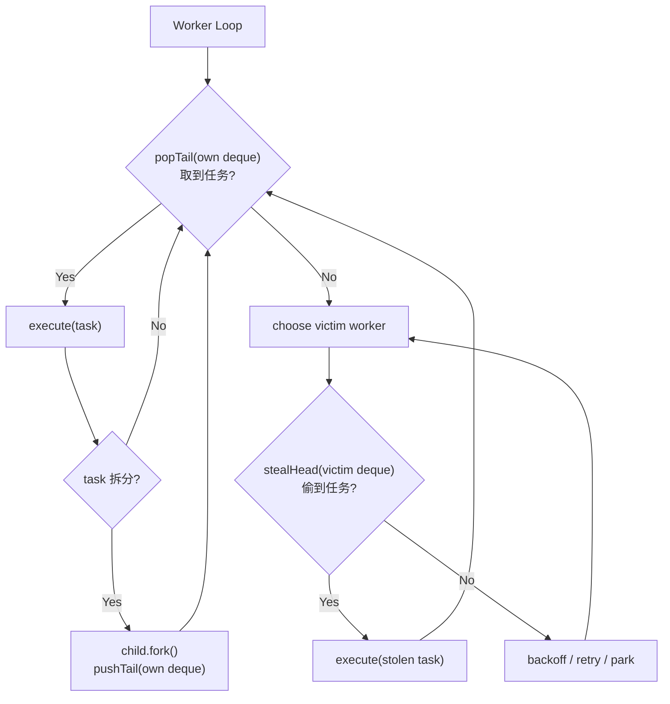

# ForkJoinPool的工作场景和使用

`ForkJoinPool` 是 JDK 并发包里专门为“可递归拆分的并行计算（divide-and-conquer）”设计的线程池实现。它的核心价值在于：把一个大任务拆成很多小任务并行执行，并通过**工作窃取（work-stealing）** 机制在各工作线程之间动态均衡负载，从而更高效地利用多核 CPU。

---

## 1) ForkJoinPool 的作用与适用场景

### 主要作用

1. **递归拆分任务并行执行**
    
    - 大任务 -> 拆成子任务 -> 子任务再拆 -> 直到足够小直接计算 -> 汇总结果。
        
2. **工作窃取提升吞吐与负载均衡**
    
    - 每个工作线程维护一个双端队列（deque）。
        
    - 自己优先从队列尾部取任务执行；空闲时从其他线程队列头部“偷”任务，减少线程闲置。
        
3. **减少线程切换与调度开销**
    
    - 与“把所有小任务都丢进一个全局队列”的线程池模型相比，局部队列 + 窃取通常更适合大量细粒度任务。
        

### 典型适用场景

- 数组/集合分治求和、归并/快速排序、并行搜索、图遍历（可分治的那类）、批量数据转换（可拆分子区间）
    
- Java 8+ `parallelStream()`、`CompletableFuture` 的部分默认执行路径（常见使用 `commonPool`）也与 ForkJoinPool 相关
    

### 不适用或要谨慎的场景

- **大量阻塞 I/O**（网络/磁盘/DB）：ForkJoinPool 默认是为 CPU-bound 设计的，阻塞会浪费工作线程。
    
- **任务拆分过细**：拆分/调度开销可能超过收益，需要设置合理的阈值（threshold）。
    
- **在 pool 线程里再去阻塞等待外部资源**：可能导致“线程都被占住但又都在等”的性能问题。
    

---

## 2) ForkJoinPool 的关键概念

### Fork/Join

- **fork()**：把子任务异步提交到当前池中执行（通常入队）。
    
- **join()**：等待子任务完成并获取结果（若子任务尚未执行，可能触发当前线程协助执行以减少等待）。
    

### 两类任务基类

- `RecursiveTask<V>`：有返回值
    
- `RecursiveAction`：无返回值
    

### 共享池（commonPool）

- `ForkJoinPool.commonPool()`：全局共享，Java 8+ 很常用（parallelStream 默认用它，除非定制）。
    
- 优点：免管理；缺点：可能与应用其他并行任务相互争抢资源，导致“互相拖累”。
    

---

## 3) 如何使用：最常见的分治模板（有返回值）

下面示例：并行求数组区间和。

```java
import java.util.concurrent.*;

public class ForkJoinSum {
    static class SumTask extends RecursiveTask<Long> {
        private static final int THRESHOLD = 10_000; // 阈值：决定何时不再拆分
        private final long[] arr;
        private final int lo, hi; // [lo, hi)

        SumTask(long[] arr, int lo, int hi) {
            this.arr = arr;
            this.lo = lo;
            this.hi = hi;
        }

        @Override
        protected Long compute() {
            int len = hi - lo;
            if (len <= THRESHOLD) {
                long sum = 0;
                for (int i = lo; i < hi; i++) sum += arr[i];
                return sum;
            }

            int mid = lo + (len / 2);
            SumTask left = new SumTask(arr, lo, mid);
            SumTask right = new SumTask(arr, mid, hi);

            // 常见写法：fork 一个，compute 另一个，最后 join
            left.fork();
            long rightResult = right.compute();
            long leftResult = left.join();
            return leftResult + rightResult;
        }
    }

    public static void main(String[] args) {
        long[] arr = new long[50_000_000];
        for (int i = 0; i < arr.length; i++) arr[i] = 1;

        ForkJoinPool pool = new ForkJoinPool(); // 默认并行度≈CPU核数
        long result = pool.invoke(new SumTask(arr, 0, arr.length));
        pool.shutdown();

        System.out.println(result);
    }
}
```

要点：

- **阈值**非常关键：过大并行度不够，过小调度开销大。
    
- 推荐模式：`left.fork(); right.compute(); left.join();`  
    比“两个都 fork 再 join”更常见，因为能让当前线程直接干活，减少空转。
    

---

## 4) 无返回值任务：RecursiveAction

例如并行对数组做原地处理（无汇总返回）。

```java
import java.util.concurrent.*;

public class ForkJoinActionDemo {
    static class FillTask extends RecursiveAction {
        private static final int THRESHOLD = 100_000;
        private final int[] arr;
        private final int lo, hi;

        FillTask(int[] arr, int lo, int hi) {
            this.arr = arr; this.lo = lo; this.hi = hi;
        }

        @Override
        protected void compute() {
            int len = hi - lo;
            if (len <= THRESHOLD) {
                for (int i = lo; i < hi; i++) arr[i] = i;
                return;
            }
            int mid = lo + len / 2;
            invokeAll(new FillTask(arr, lo, mid),
                      new FillTask(arr, mid, hi));
        }
    }

    public static void main(String[] args) {
        int[] arr = new int[10_000_000];
        ForkJoinPool.commonPool().invoke(new FillTask(arr, 0, arr.length));
    }
}
```

---

## 5) 创建与配置 ForkJoinPool（常见参数）

```java
ForkJoinPool pool = new ForkJoinPool(
    parallelism,                  // 并行度：工作线程数
    ForkJoinPool.defaultForkJoinWorkerThreadFactory,
    (t, e) -> e.printStackTrace(), // 异常处理器
    false                         // asyncMode：是否 FIFO（true）或 LIFO（false，默认）
);
```

- `parallelism`：通常设为 CPU 核数附近（CPU-bound）。
    
- `asyncMode`：默认 LIFO 更利于局部性；FIFO 更“公平”，但不一定更快。
    

---

## 6) 关于阻塞：ManagedBlocker（进阶但很实用）

如果任务里确实会阻塞（例如等待锁、等待 I/O 结果），ForkJoinPool 提供 `ForkJoinPool.ManagedBlocker` 让池“感知阻塞”，有机会补充线程以维持并行度（受限于实现和策略）。示意：

```java
ForkJoinPool.managedBlock(new ForkJoinPool.ManagedBlocker() {
    boolean done = false;

    @Override public boolean block() throws InterruptedException {
        // 做可能阻塞的等待
        // ...
        done = true;
        return true;
    }

    @Override public boolean isReleasable() {
        return done;
    }
});
```

如果你的场景是大量 I/O 阻塞，通常更推荐：

- 用专门的 I/O 线程池（如 `ThreadPoolExecutor`）或异步 I/O，
    
- 而不是把阻塞任务塞进 ForkJoinPool。
    

---

## 7) 实战建议（避免踩坑）

1. **只在“可递归拆分、CPU 密集”时优先使用 ForkJoinPool**
    
2. **谨慎使用 commonPool**
    
    - 若你的应用里 parallelStream/CompletableFuture 很多，可能互相抢 commonPool。
        
    - 关键链路建议创建专用 ForkJoinPool 或专用 Executor。
        
3. **阈值要压测**
    
    - 不同数据规模、不同机器核数，最佳阈值差异很大。
        
4. **避免在 compute() 里长时间阻塞**
    
    - 必须阻塞就考虑 `managedBlock` 或改用其他执行器。
        
5. **任务应尽量无共享可变状态**
    
    - 共享状态会引入锁竞争，抵消并行收益。
        

# Work Stealing机制

下面把 ForkJoinPool 的“工作窃取（work-stealing）”讲透：它到底“偷”什么、怎么偷、为什么这样设计、以及在 `fork()/join()` 场景里线程如何协作。

---


## 1) 工作窃取机制要解决什么问题

在“分治并行”里，任务会不断拆成很多小任务。如果把所有任务都放到一个**全局队列**：

- 多线程竞争同一个队列锁/原子操作，**争用严重**
    
- 某些线程忙、某些线程闲，难以动态均衡（特别是任务粒度不均匀）
    

ForkJoinPool 的思路是：

- **每个工作线程（Worker）都有自己的双端队列（Deque）**
    
- **自己生成的子任务，优先放自己队列里**
    
- **自己优先从自己队列里取任务执行**
    
- **当自己队列空了，就去“偷”别人的任务**
    

这就是工作窃取：让“闲线程”主动去找活，减少中心化调度的瓶颈。

---

## 2) “双端队列”里到底怎么出入队：LIFO vs FIFO（关键点）

### 每个 Worker 的 Deque：两端含义

- **尾部（tail）**：本线程本地“栈式”操作端（push/pop）
    
- **头部（head）**：被别人窃取的端（steal）
    

### 默认行为（`asyncMode=false`，也是最常见配置）

- **本线程取任务：从尾部 pop（LIFO）**
    
- **窃取别人任务：从头部 steal（FIFO）**
    

这样做的动机：

1. **局部性（locality）更好**：LIFO 让线程优先做“刚拆出来”的任务，数据更可能仍在 CPU cache 里。
    
2. **减少冲突**：本线程只频繁操作尾部；窃取者只从头部取。两端分离，降低并发冲突概率。
    
3. **更像递归调用栈**：分治任务天然像深度优先（DFS），LIFO 能更快走到“足够小”的叶子计算。
    

> `asyncMode=true` 时，本线程也更偏 FIFO（更“公平”），但通常吞吐不如默认 LIFO（要看业务）。

---

## 3) 工作窃取的核心流程（逐步解释）

### 3.1 正常工作：本地执行优先

一个 Worker 在循环里大致这么干：

1. 从**自己 deque 的 tail** 取一个任务
    
2. 执行该任务（`compute()`）
    
3. 如果任务拆分出子任务：
    
    - 子任务 `fork()`：通常压入**自己 deque 的 tail**
        
    - 当前线程可能直接 `compute()` 另一个分支
        
4. 循环继续
    

### 3.2 变闲：开始窃取

当 Worker 发现自己 deque 空了：

1. 进入“找活”状态
    
2. 随机或按一定策略选择一个“受害者线程（victim）”
    
3. 从 victim 的 deque **head** 尝试窃取一个任务
    
4. 偷到就执行；偷不到继续换 victim、或短暂等待/退避
    

### 3.3 窃取策略为何经常是“随机受害者”

- 如果所有空闲线程都盯着同一个 victim，会造成热点争用
    
- 随机化能较好分散冲突，整体吞吐更稳定
    

---

## 4) `fork()/join()` 与窃取如何配合（“help-join”思想）

分治任务常见写法：

```java
left.fork();
R r = right.compute();
L l = left.join();
return combine(l, r);
```

这里 `join()` 并不等同于“傻等”：

- 如果 `left` 还没完成，当前线程会尝试**帮助推进计算**：
    
    - 先看看 `left` 是否就在自己的 deque 里（常见情况：刚 fork 的就在本地）
        
    - 如果在，就直接拿出来执行（相当于“自己把 left 做完”）
        
    - 如果不在（可能被偷走了），可能会去执行其他可用任务，间接提高整体进度
        
- 同时，别的线程可能已经偷走了 `left` 并在执行，这也会让 join 更快返回
    

这就是 ForkJoinPool 的高效之处：**等待时尽量不阻塞，而是“帮忙干活”**。

---

## 5) 一个直观例子：两线程如何均衡负载

假设 Worker-A 拆出了很多子任务，Worker-B 很快做完自己活：

- A 的 deque：`[ head ... tail ]` 里堆了不少任务
    
- B 发现自己空了，就去 A 的 **head** 偷一个“更早产生、更可能更大块”的任务
    
- B 继续执行并可能再拆分，形成自己的 deque
    
- 结果：负载从 A 自动“流”到了 B，无需中心调度器
    

---

## 6) 流程图
### 6.1 Worker 主循环 + 窃取流程




### 6.2 `fork()/join()` 的协作（help-join）

```
Task.compute():
  if (small) doDirect()
  else
     left.fork()   -> left 入队(通常在本线程 deque tail)
     rightResult = right.compute()   (当前线程继续干活)
     leftResult  = left.join()
        join 内部可能:
          - 若 left 仍在本地队列：直接取出执行
          - 若 left 被偷：当前线程做别的任务/等待其完成
     return combine(leftResult, rightResult)
```

---

## 7) 你需要特别记住的“实现要点/直觉”

1. **本地 LIFO + 远端 FIFO** 是经典 work-stealing deque 方案：兼顾局部性与并发冲突控制。
    
2. **fork() 不是“立刻并行执行”保证**：它通常只是入队，何时执行由调度决定（可能自己执行，也可能被偷走）。
    
3. **join() 不是纯阻塞等待**：ForkJoinPool 尽量让等待线程去“帮忙做事”，提升整体吞吐。
    
4. **不适合大量阻塞 I/O**：阻塞会让工作线程失去计算能力，削弱窃取的意义（除非用 `ManagedBlocker` 等手段或改用其他线程池）。
    

# 结合Java8的并行Stream
在 Java 8 中，**并行 Stream 默认使用 `ForkJoinPool.commonPool()`**。如果你不希望使用 commonPool，主流做法只有一种可靠路径：**把并行 Stream 的执行“包”在你自建的 `ForkJoinPool` 的工作线程里运行**，让 Stream 在“当前线程属于哪个 ForkJoinPool”这一上下文中选择你指定的池。

下面给你可直接复用的方案与原因说明，并把常见坑点一并讲清楚。

---

## 1) 做法：自建 ForkJoinPool，并在池内执行并行 Stream

### 示例（推荐写法）

```java
import java.util.concurrent.ForkJoinPool;
import java.util.concurrent.ForkJoinTask;
import java.util.stream.IntStream;

public class CustomPoolParallelStreamDemo {

    public static void main(String[] args) {
        ForkJoinPool pool = new ForkJoinPool(8); // 例如 8 个并行度（通常接近 CPU 核数）

        ForkJoinTask<Long> task = pool.submit(() ->
            IntStream.rangeClosed(1, 10_000_000)
                     .parallel()
                     .asLongStream()
                     .sum()
        );

        long result = task.join();
        pool.shutdown();

        System.out.println(result);
    }
}
```

### 为什么这能生效

并行 Stream 的底层是 `ForkJoin` 框架（`CountedCompleter`/`ForkJoinTask` 等）。当你在 **ForkJoinPool 的工作线程**中触发并行 Stream，框架会优先在“当前池”里调度任务（即你创建的池），而不是落到 `commonPool()`。

以下是源码分析

### 1.1 Stream 侧：并行算子会创建任务并直接 `invoke()`

以 `SliceOps` 为例，它在并行求值路径里创建 `SliceTask` 并调用 `invoke()`：  
`return new SliceTask<>(...).invoke().spliterator();` [CoCalc](https://cocalc.com/github/PojavLauncherTeam/openjdk-multiarch-jdk8u/blob/aarch64-shenandoah-jdk8u272-b10/jdk/src/share/classes/java/util/stream/SliceOps.java)

这说明：Stream 框架很多时候**并不显式写死**“提交到 commonPool”，而是依赖 ForkJoinTask 的运行时上下文选择执行位置。

### 1.2 ForkJoinTask 侧：是否在 worker 线程中，决定走“本地队列”还是走 commonPool

`ForkJoinTask.fork()` 的实现非常直白：

- 如果当前线程是 `ForkJoinWorkerThread`：把任务 `push` 到该 worker 的本地队列
    
- 否则：走 `ForkJoinPool.common.externalPush(this)`，也就是把任务推到 **commonPool** [CoCalc](https://cocalc.com/github/PojavLauncherTeam/openjdk-multiarch-jdk8u/blob/aarch64-shenandoah-jdk8u272-b10/jdk/src/share/classes/java/util/concurrent/ForkJoinTask.java)
    

对应代码片段（你可以直接对照）在 `ForkJoinTask.fork()`：

- `if (Thread.currentThread() instanceof ForkJoinWorkerThread) ... push(this); else ForkJoinPool.common.externalPush(this);` [CoCalc](https://cocalc.com/github/PojavLauncherTeam/openjdk-multiarch-jdk8u/blob/aarch64-shenandoah-jdk8u272-b10/jdk/src/share/classes/java/util/concurrent/ForkJoinTask.java)
    

同时，ForkJoinTask 的类注释也明确写了：如果没有处于 ForkJoin 计算中，`fork/invoke` 等会在 `ForkJoinPool#commonPool()` 中开始执行 [CoCalc](https://cocalc.com/github/PojavLauncherTeam/openjdk-multiarch-jdk8u/blob/aarch64-shenandoah-jdk8u272-b10/jdk/src/share/classes/java/util/concurrent/ForkJoinTask.java)

### 1.3 把两点拼起来，就是结论链

1. 并行 stream 在并行求值时会创建 ForkJoin 任务并 `invoke()`（例如 SliceOps）[CoCalc](https://cocalc.com/github/PojavLauncherTeam/openjdk-multiarch-jdk8u/blob/aarch64-shenandoah-jdk8u272-b10/jdk/src/share/classes/java/util/stream/SliceOps.java)
    
2. ForkJoin 任务在 `fork()` 时，如果当前线程是自定义 pool 的 `ForkJoinWorkerThread`，就进该 pool 的本地队列；否则会推到 commonPool [CoCalc+1](https://cocalc.com/github/PojavLauncherTeam/openjdk-multiarch-jdk8u/blob/aarch64-shenandoah-jdk8u272-b10/jdk/src/share/classes/java/util/concurrent/ForkJoinTask.java)
    

因此：

- **你在自定义 pool 的 worker 线程里触发并行 stream**（`pool.submit(() -> stream.parallel()....terminalOp())`），后续 fork/join 调度自然都留在这个 pool 内部，不会跑到 commonPool。
    
- **你在普通线程触发并行 stream**，就容易回落到 commonPool（因为 fork 的 else 分支直通 common）。

---

## 2) 这样做的原因（为什么要避开 commonPool）

你不想用 commonPool，通常是出于以下一个或多个原因：

1. **隔离性（Isolation）**
    
    - commonPool 是进程级共享资源：你应用里的其他并行流、某些 `CompletableFuture` 默认路径、以及第三方库可能也在用它。
        
    - 一旦某个模块/库在 commonPool 里跑了重任务或阻塞任务，可能拖慢你这条链路。
        
2. **可控性（Control）**
    
    - 你无法对 commonPool 做精细化容量规划、线程命名、异常处理策略隔离等（即使可以设置系统属性，也偏全局、侵入性强）。
        
    - 自建池可以指定 parallelism、线程工厂（命名/优先级/UncaughtExceptionHandler）、甚至独立监控指标。
        
3. **避免“阻塞污染”（Blocking Contamination）**
    
    - ForkJoinPool 原本适合 CPU-bound。如果 commonPool 中混入阻塞 I/O、锁等待、RPC 等，会导致工作线程被占住，窃取机制也救不了，整体吞吐下降。
        
    - 你把并行 Stream 放到专用池里，至少把“阻塞风险”局部化，不会把全局 commonPool 一起拖垮。
        
4. **避免“隐式并行度争抢”**
    
    - commonPool 的并行度通常≈CPU核数-1（受实现与配置影响）。
        
    - 如果你同时跑多个并行 Stream，都抢这同一份并行度，很容易出现互相饿死或抖动。
        

---

## 3) 常见替代方案与注意事项

### 3.1 方案 A：用 `pool.submit(() -> stream.parallel()...)`（最常用、最实用）

优点：最少改动、清晰、隔离性好。  
缺点：需要你确保并行 Stream 的触发点确实在这个池的 worker 线程中。

### 3.2 方案 B：设置系统属性让“默认公共池”不再公共（不推荐用于库/大型系统）

例如启动参数：

- `-Djava.util.concurrent.ForkJoinPool.common.parallelism=...`
    

这不是“禁用 commonPool”，而是调整它的并行度；仍然是共享池，隔离性差，而且影响全局行为，容易引发不可预期副作用。通常不如专用池安全。

### 3.3 重要注意：**并行 Stream 不支持像 CompletableFuture 那样直接传 Executor**

`parallelStream()`/`.parallel()` 没有官方 API 让你“显式指定 Executor”。因此“专用池包裹执行”是最现实、最可控的策略。

---

## 4) 什么时候你不该用并行 Stream（即便换了池）

即便自建池，下面场景仍需谨慎：

- **流中包含阻塞 I/O**（HTTP、DB、文件、`Thread.sleep`、等待锁等）  
    并行 Stream 的工作线程一阻塞，就会降低并行度，甚至导致性能比串行更差。  
    建议：I/O 用专门的 `ThreadPoolExecutor` 或异步 I/O；CPU 部分再用并行 Stream/ForkJoin。
    
- **任务非常轻或数据量很小**  
    并行拆分、调度、合并开销会吞掉收益。
    

---

## 5) 实务建议：如何选择专用池的并行度

- CPU 密集：`parallelism ≈ CPU 核数`（或核数-1）是常见起点，最终以压测为准。
    
- 混合型或偶有阻塞：要么拆分执行器（I/O 一套、CPU 一套），要么考虑更高 parallelism 但要谨慎（会引入更多上下文切换与资源争用）。
    

