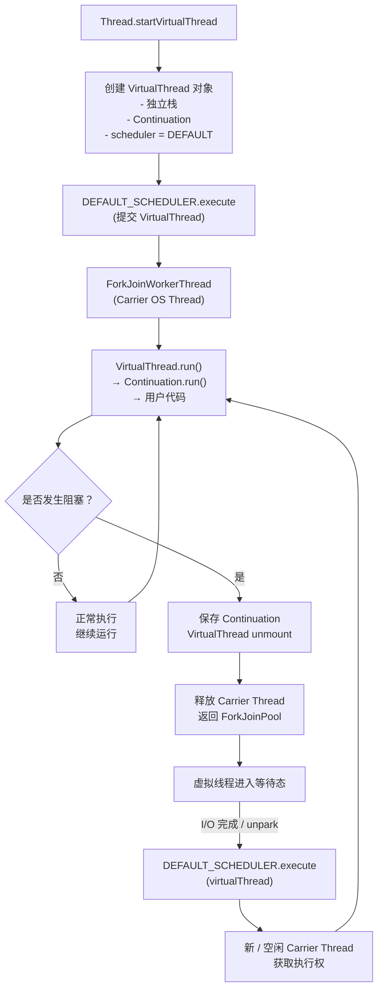

# 线程调度的历史发展流程
**“载体线程必须来自某个线程提供者（调度器/执行器）”这一思想在 JDK 21 之前就已经存在**；虚拟线程并不是凭空引入这一模型，而是 **在既有并发与调度设计之上，把“线程”这一概念拆分得更彻底**。不过，需要强调的是：

> **以前版本中“线程提供者”的存在是“隐式的”，而在虚拟线程中变成了“显式且关键的”。**

下面按时间和层级系统梳理。

---

## 一、最早的原型：Executor（JDK 5）

### 1. Executor 本身就是“线程提供者”抽象

JDK 5（Java 5）引入：

```java
java.util.concurrent.Executor
```

其语义并不是“执行任务”，而是：

> **为任务提供执行所需的线程资源**

在 JDK 文档中，Executor 被定义为：

- 解耦 **任务提交** 与 **任务执行**
    
- 屏蔽线程创建、复用、调度策略
    

这实际上已经确立了一个核心思想：

> **任务本身不关心线程来自哪里**

---

### 2. 在平台线程时代：关系是反过来的

在 Java 5 ~ Java 20：

```text
Runnable / Callable
   ↓
Executor
   ↓
Platform Thread (OS Thread)
```

- **任务是轻量的**
    
- **线程是重量级的**
    
- Executor 管理线程生命周期
    

此时还没有“线程跑在线程上”的概念。

---

## 二、ForkJoinPool：第一次“调度器化”的线程模型（Java 7）

### 1. ForkJoinWorkerThread 的特殊性

`ForkJoinPool`（Java 7）已经具备以下特征：

- 线程不是“一任务一线程”
    
- 线程反复执行多个任务
    
- 支持 **work-stealing**
    

更重要的是：

```text
ForkJoinTask
   ↓
ForkJoinPool (Scheduler)
   ↓
ForkJoinWorkerThread
```

这里已经出现了**“调度器 → 工作者线程”**的明确分层。

---

### 2. ManagedBlocker：关键的历史伏笔

Java 8 引入：

```java
ForkJoinPool.ManagedBlocker
```

用途是什么？

> **告诉调度器：当前任务要阻塞了，你可能需要补充线程**

这是非常关键的一步，因为它意味着：

- 阻塞不再是“线程私事”
    
- 阻塞需要通知调度器
    
- 调度器负责线程补偿
    

👉 这在语义上已经非常接近虚拟线程的 **unmount / remount** 思想。

---

## 三、CompletableFuture：任务彻底与线程解绑（Java 8）

### 1. 默认 Executor 的引入

```java
CompletableFuture.supplyAsync(() -> ...)
```

如果你不传 Executor：

- 默认使用 `ForkJoinPool.commonPool()`
    

这里体现的是：

> **异步计算本身不再拥有线程，线程由 Executor 提供**

---

### 2. continuation 不是在“当前线程”运行

CompletableFuture 的 thenApply / thenCompose：

- 可能在不同线程运行
    
- 完全由 Executor 决定
    

这已经是“执行上下文漂移”的早期形式。

---

## 四、Project Loom 之前：已经存在的“准载体线程”模式

在 Loom 之前，Java 中已经存在若干“类载体”关系：

### 1. Netty EventLoop

```text
Task
   ↓
EventLoop
   ↓
Single Thread
```

- 任务不感知线程
    
- 线程是调度器的资源
    

---

### 2. Akka / Actor 模型

```text
Message
   ↓
Dispatcher
   ↓
Thread Pool
```

Actor 从来不“拥有线程”。

---

## 五、虚拟线程的真正创新点在哪里？

### 1. 首次把“线程”也变成了被调度对象

在 JDK 21 之前：

|被调度对象|是什么|
|---|---|
|Runnable|是|
|Callable|是|
|ForkJoinTask|是|
|CompletableFuture|是|
|**Thread**|❌ 否|

而在 JDK 21：

```text
VirtualThread
   ↓ scheduled by
Executor
   ↓ runs on
Platform Thread
```

这是第一次：

> **线程本身成为调度器的“任务”**

---

### 2. Executor 从“任务调度器”升级为“线程调度器”

以前：

```text
Executor schedules tasks
```

现在：

```text
Executor schedules virtual threads (which execute code)
```

但 Executor 接口**没有变化**，这正是设计的高明之处。

---

## 六、结论：不是新概念，而是“终极形态”

### 精准结论

- ✅ **“线程提供者”这一角色在 JDK 5 就已经存在**
    
- ✅ **ForkJoinPool 已经部分具备载体线程的雏形**
    
- ❌ **但在 JDK 21 之前，没有“线程运行在线程之上”的模型**
    

### 虚拟线程的本质创新

> **把“线程”降格为一种可被调度、可被挂起的执行上下文，而 Executor 则自然成为它的提供者与调度器。**


# 为什么在实现中需要绑定一个调度器
在 **JDK 21** 中，**虚拟线程（Virtual Thread）** 之所以在实现上要**绑定一个 `Executor`**，并不是为了“多此一举”，而是出于 **调度模型、与现有并发框架的兼容性，以及运行时可控性** 等多个方面的必然设计选择。下面从实现机制层面系统说明原因。

---

## 一、虚拟线程本质上仍然需要“承载者”

### 1. 虚拟线程 ≠ 自行运行的线程

虚拟线程是 **由 JVM 调度的用户态线程**，它本身**不直接运行在 CPU 上**，而是：

- **运行在某个载体线程（Carrier Thread）上**
    
- 载体线程本质是一个 **平台线程（OS Thread）**
    

> 虚拟线程只描述 _执行上下文_，并不拥有真实的执行资源。

### 2. 载体线程从哪里来？

载体线程的来源必须是一个 **线程提供者**，在 Java 里这个角色天然就是：

- `Executor`
    
- 特别是 `ForkJoinPool` 这种工作窃取调度器
    

因此，**虚拟线程必须绑定一个 `Executor`，用来提供和管理载体线程**。

---

## 二、Executor 是虚拟线程的“调度器抽象”

### 1. 虚拟线程调度模型（简化）

```text
VirtualThread
   ↓ mount
Carrier Thread (Platform Thread)
   ↓ execute
CPU
```

当虚拟线程：

- 启动
    
- 被 `unpark`
    
- 从阻塞 I/O 中恢复
    

都需要 **重新提交到某个调度器执行**。

这个“调度器”在 Java 中并不是硬编码的，而是通过 **`Executor` 抽象**完成的。

---

## 三、为什么不让 JVM 自己管理线程池？

### 核心原因：**控制权与可组合性**

#### 1. Executor 是 Java 并发的“事实标准接口”

- `CompletableFuture`
    
- `StructuredTaskScope`
    
- `Executors.newVirtualThreadPerTaskExecutor()`
    
- 各种框架（Spring、Netty、Quarkus）
    

全部围绕 `Executor` 构建。

> 让虚拟线程绑定 Executor，可以 **无缝融入现有生态**。

---

#### 2. Executor 提供关键的“策略注入点”

通过 Executor，可以控制：

|能力|说明|
|---|---|
|并行度|限制载体线程数量|
|调度策略|FIFO / Work-Stealing|
|资源隔离|不同业务使用不同 Executor|
|可观测性|监控、统计、Tracing|

如果虚拟线程由 JVM 全权管理，这些能力将无法暴露。

---

## 四、默认情况下绑定的是什么 Executor？

### JDK 21 默认行为

```java
Thread.ofVirtual().start(() -> { ... });
```

背后绑定的是：

```text
ForkJoinPool
  └── VirtualThreadScheduler
```

特征：

- **共享全局调度器**
    
- 并行度 ≈ `Runtime.getRuntime().availableProcessors()`
    
- 仅用于承载虚拟线程的执行片段
    

> 这是一个 **专门为虚拟线程设计的调度器**，但仍然实现为 `Executor`。

---

## 五、为什么虚拟线程不能“自己阻塞自己”？

### 关键点：**挂起（park）≠ 占用线程**

当虚拟线程执行到：

- `LockSupport.park()`
    
- 阻塞 I/O
    
- `synchronized` 等
    

JVM 会：

1. **卸载虚拟线程（unmount）**
    
2. **释放载体线程回 Executor**
    
3. 等待事件完成
    
4. **重新提交虚拟线程到 Executor**
    

没有 Executor，就无法完成这一生命周期闭环。

---

## 六、与 Structured Concurrency 的关系

`StructuredTaskScope` 示例：

```java
try (var scope = new StructuredTaskScope.ShutdownOnFailure()) {
    Future<A> fa = scope.fork(taskA);
    Future<B> fb = scope.fork(taskB);
    scope.join();
}
```

其内部机制是：

- 将每个任务提交到 **虚拟线程 Executor**
    
- Executor 决定实际载体线程调度
    

这使得：

- 任务生命周期可控
    
- 取消、失败传播可统一处理
    

---

## 七、总结：绑定 Executor 是“必然设计”，不是实现妥协

### 一句话结论

> **虚拟线程绑定 Executor，是为了把“执行资源管理”与“执行上下文”解耦。**

### 核心原因汇总

|原因|说明|
|---|---|
|虚拟线程不拥有 CPU|必须运行在平台线程上|
|Executor 是线程资源抽象|提供载体线程|
|调度需要可控|并行度、隔离、策略|
|生态兼容性|无缝接入现有并发框架|
|支持挂起/恢复|park/unpark 生命周期|

# 调度过程是否就是虚拟线程创建的过程？

## 一、先给出最重要的否定结论

> ❌ **JVM 并没有“预先创建一批虚拟线程”**  
> ❌ **`Executor` 也不会把任务“调度到某个空闲的虚拟线程上”**  
> ❌ **虚拟线程不是池化的，也不存在复用**

**每一个 `Thread.ofVirtual().start(...)` 都创建一个全新的虚拟线程对象。**

---

## 二、“调度”的对象是谁

### 平台线程时代（你熟悉的）

```text
Runnable
   ↓ (schedule)
Executor
   ↓
Platform Thread (OS Thread)
```

- 被调度的是 **任务（Runnable）**
    
- 线程是稀缺资源
    
- 线程需要复用（线程池）
    

---

### 虚拟线程时代（关键反转）

```text
VirtualThread (implements Runnable)
   ↓ (schedule)
Executor  ← myExecutor
   ↓
Platform Thread (Carrier Thread)
```

> **被调度的对象不再是“业务任务”，而是“虚拟线程本身”。**

这句话如果你只记一句，请记这一句。

---

## 三、`Executor` 到底在“调度什么”？

### 精准答案

> **`Executor` 调度的是：  
> 「某个虚拟线程的下一段运行时间片」**

不是虚拟线程池，不是任务池，不是复用。

---

## 四、拆解这行代码在 JVM 里发生了什么

```java
Thread.ofVirtual().scheduler(myExecutor).start(() -> {
    doSomething();
});
```

### Step 1：创建虚拟线程（一次性的）

```text
new VirtualThread(
    task = doSomething,
    scheduler = myExecutor
)
```

此时：

- 虚拟线程对象存在了
    
- 有独立栈、Continuation
    
- **还没运行**
    

---

### Step 2：启动虚拟线程

```text
scheduler.execute(virtualThread)
```

注意：

- `virtualThread` 本身就是一个 `Runnable`
    
- `Executor` 根本不知道这是“线程”
    

---

### Step 3：Executor 做它一贯做的事

```text
myExecutor:
  - 选一个空闲的 OS 线程
  - 调用 runnable.run()
```

这个 `run()` 实际是：

```java
VirtualThread.run()
```

---

### Step 4：虚拟线程运行 + 可能挂起

```text
VirtualThread.run()
   ↓
Continuation.run()
   ↓
doSomething()
```

如果执行过程中：

- I/O 阻塞
    
- park()
    
- sleep()
    

那么：

1. **虚拟线程被挂起（unmount）**
    
2. **OS 线程立即归还给 Executor**
    
3. 虚拟线程进入等待状态
    

---

### Step 5：恢复时再次“被调度”

当 I/O 完成：

```text
scheduler.execute(virtualThread)
```

**还是同一个虚拟线程对象**

---

## 五、现在回答最核心的误解点

> **“是不是 JVM 内部已经创建了一批虚拟线程，然后通过 myExecutor 调度到空闲的虚拟线程上？”**

### 明确回答：**完全不是**

|项目|真实情况|
|---|---|
|虚拟线程是否池化|❌ 否|
|是否复用虚拟线程|❌ 否|
|Executor 是否管理虚拟线程数量|❌ 否|
|Executor 管理的是什么|✅ OS 线程|
|虚拟线程的数量谁决定|✅ 你的 `newVirtualThread` 调用次数|

---

## 六、那“调度”的意义到底是什么？

### 一句话版（请认真读）

> **调度的意义是：  
> 决定“某个虚拟线程的某一段代码，在哪个 OS 线程上运行”。**

---

### 再换一种更直觉的说法

虚拟线程是：

> **“可暂停、可恢复的执行过程”**

Executor 的职责是：

> **“给这个执行过程找一个临时的 CPU 承载者”**

---

## 七、为什么这个设计极其重要？

如果没有这种调度机制，会发生什么？

### 假设虚拟线程直接绑定 OS 线程

```text
VirtualThread → 固定 OS Thread
```

那就意味着：

- 一阻塞就浪费 OS 线程
    
- 回到线程池 + 回调地狱
    
- Loom 完全失去意义
    

---

## 八、你现在应该形成的正确心智模型

### 正确模型

```text
虚拟线程 = 执行状态 + 栈 + Continuation
Executor = OS 线程资源池
调度 = 把执行状态临时“放到”一个 OS 线程上跑
```

### 错误模型（请彻底丢弃）

```text
Executor 管理虚拟线程池
Executor 把任务分配给虚拟线程
虚拟线程像平台线程一样复用
```

> **在 Loom 之前：线程是执行者，任务是被调度的对象**  
> **在 Loom 之后：线程本身成为被调度的对象**

这就是“线程调度”的真正含义。

# “调度的本质”


> **虚拟线程并不是“要求尽量不要阻塞”，  
> 而是“允许阻塞，但不能占用 OS 线程”。  
> 因此在阻塞发生时，虚拟线程会被挂起（unmount），  
> 阻塞解除后需要重新找一个 OS 线程继续运行，  
> 这个“找 OS 线程并安排运行”的过程，就由 Executor 完成。**

这就是调度的本质。

---

## 一、为什么“不是尽量不要阻塞”这一点很重要？

### 如果虚拟线程“要求不阻塞”，那它就失败了

Loom 的目标恰恰是：

- 你可以 **像写同步代码一样写**
    
- 可以 **随便阻塞**
    
- JVM 来替你处理阻塞成本
    

例如：

```java
try (var socket = new Socket(host, port)) {
    socket.getInputStream().read(); // 阻塞
}
```

在虚拟线程中：

- ✔ 完全合法
    
- ✔ 高并发安全
    
- ✔ 不浪费 OS 线程
    

> **阻塞不是问题，占用 OS 线程才是问题。**

---

## 二、Executor 在“挂起 / 恢复”中的真实角色

我们把全过程再用一条线走一遍，但这次只关注“为什么非要 Executor 不可”。

---

### 1️⃣ 虚拟线程运行时

```text
VirtualThread
   ↓ mount
OS Thread (carrier)
   ↓
执行用户代码
```

---

### 2️⃣ 发生阻塞（I/O / park / sleep）

```text
用户代码
   ↓
阻塞点
```

JVM 做的事情是：

1. **保存虚拟线程的执行状态（Continuation）**
    
2. **把虚拟线程从 OS 线程上“卸下来”**
    
3. **释放 OS 线程**
    

关键点：

> 此时虚拟线程还活着，只是“暂停”。

---

### 3️⃣ 阻塞解除（I/O ready / unpark）

现在问题来了：

> **虚拟线程如何继续运行？**

它自己做不到，因为：

- 它没有 OS 线程
    
- 它不能直接抢 CPU
    

---

### 4️⃣ Executor 登场（调度的本质）

JVM 只能做一件事：

```text
scheduler.execute(virtualThread)
```

含义是：

> **“请你（Executor）帮我找一个可用的 OS 线程，  
> 让这个虚拟线程继续跑。”**

Executor 的职责在此刻非常明确：

- 管理 OS 线程
    
- 决定什么时候跑
    
- 决定在哪个 OS 线程上跑
    

---

## 三、为什么不能“直接在 JVM 里调度”？为什么一定要 Executor？

这是你这个问题的**最后一层本质**。

### 原因不是“技术做不到”，而是**设计必然性**

### 1. Executor 是 Java 世界的“调度协议”

- 线程池
    
- ForkJoinPool
    
- Structured Concurrency
    
- CompletableFuture
    

**所有并发基础设施都围绕 Executor**

虚拟线程必须融入这个世界，而不是另起炉灶。

---

### 2. Executor 是 OS 线程的“所有者”

> **谁创建 OS 线程，谁就必须调度它。**

- JVM 不直接管理业务线程池
    
- Executor 才知道线程数量、饥饿、隔离策略
    

---

### 3. Executor 是“策略注入点”

通过 Executor，你可以控制：

- 最大并行度
    
- 资源隔离
    
- 调度策略
    
- 观测与限流
    

如果虚拟线程绕过 Executor，这一切都会失效。

---

## 四、理解“定型”

你现在可以这样总结（这是**完全正确的版本**）：

> **虚拟线程允许阻塞，但阻塞时必须释放 OS 线程；  
> 阻塞解除后，需要重新找 OS 线程继续执行；  
> Executor 正是负责“为虚拟线程分配和调度 OS 线程”的组件。**

如果你已经能自然地说出这句话，说明你已经**真正理解了虚拟线程调度存在的意义**。

# JDK默认调度器实现分析
很好，这一步已经进入 **Loom 真正的“运行时调度机制”** 了。下面会**严格围绕 JDK 21 的 `DEFAULT_SCHEDULER`**，按 _是什么 → 怎么调度 → 发生阻塞时如何流转_ 的顺序说明，并在最后给一个**完整、可对照源码的流程图**。

---

## 一、`DEFAULT_SCHEDULER` 是什么（精确定义）

在 JDK 21 中：

> **`DEFAULT_SCHEDULER` 是一个由 JVM 创建并持有的、专门用于调度虚拟线程的 `ForkJoinPool`。**

它的职责只有一个：

> **为虚拟线程提供可运行时所需的 OS 线程（Carrier Thread）并调度其执行。**

注意三个关键词：

- **不是**创建虚拟线程
    
- **不是**管理虚拟线程数量
    
- **只负责**调度虚拟线程“什么时候、在哪个 OS 线程上跑”
    

---

## 二、`DEFAULT_SCHEDULER` 的关键配置特征

逻辑上可以理解为：

```text
ForkJoinPool (VirtualThreadScheduler)
├─ parallelism ≈ CPU 核数
├─ asyncMode = true (FIFO)
├─ worker threads = ForkJoinWorkerThread (carrier)
└─ JVM 深度感知（virtual-thread-aware）
```

这些配置决定了它的**调度语义**：

- **不追求 CPU 密集吞吐**
    
- **优先公平、快速恢复**
    
- **极度频繁的 park / unpark 友好**
    

---

## 三、DEFAULT_SCHEDULER 调度的“对象”是什么？

这是理解流程图前必须再次确认的一点：

> **被调度的对象是：`VirtualThread` 实例本身（它实现了 `Runnable`）**

不是业务 `Runnable`，不是 `Callable`，而是：

```java
class VirtualThread implements Runnable
```

---

## 四、正常执行路径（无阻塞）

### 1️⃣ 创建并启动虚拟线程

```java
Thread.startVirtualThread(task);
```

JVM 内部逻辑（简化）：

```text
new VirtualThread(task, DEFAULT_SCHEDULER)
↓
DEFAULT_SCHEDULER.execute(virtualThread)
```

---

### 2️⃣ DEFAULT_SCHEDULER 接收任务

```text
ForkJoinPool
↓
将 virtualThread 放入某个 worker 的任务队列
```

---

### 3️⃣ Carrier Thread 执行

```text
ForkJoinWorkerThread (OS Thread)
↓
virtualThread.run()
↓
Continuation.run()
↓
执行用户代码
```

到这里为止，一切和“普通 Runnable”看起来几乎一样。

---

## 五、发生阻塞时：调度逻辑的核心价值

现在进入你真正关心的部分。

---

### 关键前提

阻塞类型包括：

- I/O（socket / file / selector）
    
- `LockSupport.park`
    
- `sleep`
    
- monitor 竞争（部分情况）
    

---

## 六、DEFAULT_SCHEDULER 的完整调度流程图（重点）

下面这个流程图你可以当作 **“虚拟线程调度的心智模型定稿版”**。

---

### 🌐 虚拟线程 + DEFAULT_SCHEDULER 调度流程图



---

## 七、为什么 DEFAULT_SCHEDULER 必须是 ForkJoinPool？

从流程图你可以清楚看到，它必须具备这些能力：

1. **高频 submit / execute**
    
2. **极低成本的线程切换**
    
3. **OS 线程复用**
    
4. **阻塞感知 & 补偿能力**
    
5. **与 JVM safepoint / GC 协同**
    

目前 **只有 ForkJoinPool 满足全部条件**，而且 JVM 已经为它做了 Loom 级别的增强。

---

## 八、一句话总结 DEFAULT_SCHEDULER 的调度逻辑

你现在可以这样准确地描述它：

> **DEFAULT_SCHEDULER 是一个专用的 ForkJoinPool，它反复执行以下循环：  
> 把虚拟线程当作任务调度到 OS 线程上运行；  
> 一旦虚拟线程阻塞，就立即释放 OS 线程；  
> 阻塞解除后，再次调度该虚拟线程继续执行。**

# 验证虚拟线程的切换
```java
import java.time.Duration;
import java.util.concurrent.Executors;
import java.util.stream.IntStream;

public class VirtualThreadCarrierSwitch {

    public static void main(String[] args) {
        // 使用 Java 21 的 try-with-resources 语法自动关闭 Executor
        // 这会等待所有任务执行完毕
        try (var executor = Executors.newVirtualThreadPerTaskExecutor()) {
            
            // 启动 5 个虚拟线程任务
            IntStream.range(0, 5).forEach(i -> {
                executor.submit(() -> {
                    // 1. 获取阻塞前的 Carrier 线程信息
                    String before = getCarrierThreadName();
                    
                    System.out.printf("任务 #%d [阻塞前] 运行在: %s%n", i, before);

                    try {
                        // 2. 执行阻塞操作 (Sleep 50ms)
                        // 此时虚拟线程会从 Carrier Thread 上卸载 (Unmount)
                        Thread.sleep(Duration.ofMillis(50)); 
                    } catch (InterruptedException e) {
                        Thread.currentThread().interrupt();
                    }

                    // 3. 获取阻塞后的 Carrier 线程信息
                    // 此时虚拟线程已重新挂载 (Remount)，可能在不同的 Worker 上
                    String after = getCarrierThreadName();
                    
                    System.out.printf("任务 #%d [阻塞后] 运行在: %s%n", i, after);
                    
                    // 4. 检查是否发生了切换
                    if (!before.equals(after)) {
                        System.out.printf(">>> 💥 观察到切换! 任务 #%d 从 [%s] 切换到了 [%s]%n", i, before, after);
                    } else {
                        System.out.printf(">>> 任务 #%d 没有切换 Carrier (属于运气或调度优化)%n", i);
                    }
                });
            });
        }
    }

    /**
     * 辅助方法：从 Thread.toString() 中提取 Carrier Thread 的名称。
     * 虚拟线程的 toString() 格式通常为: 
     * VirtualThread[#21]/runnable@ForkJoinPool-1-worker-1
     * 我们需要 "@" 后面的部分。
     */
    private static String getCarrierThreadName() {
        String threadString = Thread.currentThread().toString();
        int atIndex = threadString.indexOf("@");
        if (atIndex != -1) {
            return threadString.substring(atIndex + 1);
        }
        return "Unknown";
    }
}
```
