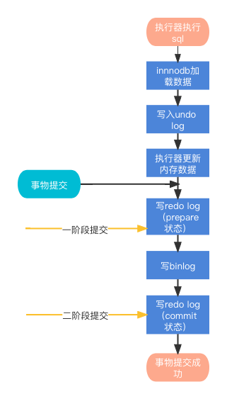

## 浅谈MySQL是如何保证数据可靠性

MySQL是一款基于文件系统的数据库中间件，只要 redo log 和 binlog 保证持久化到磁盘，就能确保 MySQL 异常重启后，数据可以恢复。本文简单研究下MySQL写入redo log和binlog的流程

### binlog的写入流程

一个事物在执行过程中，并不会直接将日志写入binlog，而是先将其写入binlog cache，待到整个事物**完全提交**时，再将binlog cache写入到binlog文件中。

同时，一个事物的binlog时无法进行拆分的，也就是说，不论这个事物有多大，也要确保一次性写入。

#### binlog cache保存机制

MySQL会在内存之中开辟一块区域，用于存放binlog cache，每个线程占有一块，线程与线程之间互不影响。

参数`binlog_cache_size`用于控制单个线程内的binlog cache的内存区域大小，一旦超过了这个参数的大小，则会暂存到磁盘（这里并不会直接写入binlog文件，而是写入到文件系统的page cache中），这个过程一般称之为`write`

写入到page cache中后，MySQL则会将page cache持久化到磁盘，这个过程一般称之为`fsync`

`fsync`的过程取决于磁盘到io速度，这个过程的速度往往会低于写入page cache

的速度。

`write`和`fsync`的时机，是由参数`sync_binlog`控制：

* sync_binlog=0时，表示每次事物提交时，都只write，不进行fsync
* sync_binlog=1时，表示每次事物提交时都会执行write和fsync
* sync_binlog=N(N>1)时，表示每个事物提交后都`write`，累计N个事物后再进行`fsync`

在IO瓶颈的场景里，将`sync_binlog`设置成比较大的值，是一个很不错的优化手段。但是对应的风险是：一旦数据库发生异常宕机，会丢失掉最近N个事物的binlog日志

### redo log的写入流程

redo log的写入跟binlog有些类似。事物执行过程中，redo log也是直接写在内存之中，这个区域被称为`redo log buffer`，这些日志会伴随着innodb的后台线程持久化到磁盘之中。

除了后台线程定期持久化以外，当`redo log buffer`占用的空间达到`innodb_log_buffer_size`的一半，此时后台线程会主动持久到磁盘，注意，此时只是写入到磁盘的page size，并没有`fsync`

为了控制redo log的写入策略，innodb提供了`innodb_flush_log_at_trx_commit`参数，它有三种取值：

1. 当设置成0时，表示每次事物提交时，都只是把redo log留在buffer中
2. 当设置成1时，表示每次事物提交时都将redo log直接持久化到磁盘（fsync）
3. 当设置成2时，表示每次事物提交时都将redo log写入到磁盘的page cache

那么有没有一种可能，事物还没有提交，redo log就已经持久化到磁盘了？

其实是有可能的，除了前面提及的后台线程定期持久化以及buffer占用过高时主动持久化。还有一种可能就是：**其他并行事物提交的时候，会顺带将当前事物的redo log一并持久化**（`innodb_flush_log_at_trx_commit` = 1）

### 两阶段提交

Innodb为了保证事物提交时的数据一致性，采用了两阶段提交的方案，如下图所示

至于为什么要设计成这样，我的猜想是，**为了适配分布式事物，比如XA，XA的事物提交就是两阶段的，因此MySQL也设计成这样**。

至于一阶段提交中redo log和binlog的写入顺序能不能反过来，我认为是不可以的：**redo log是innodb引擎专有，属于引擎层，而binlog是MySQL属于系统层次，同时MySQL也是基于binlog进行的主从同步，那么就一定要保证binlog写入时，sql语句的实际执行操作在引擎层已经记录。所以binlog的写入顺序只能在redo log之后**

了解完两阶段提交后，我们再来看一个问题：**如果某一时刻MySQL突然宕机了，MySQL时如何恢复数据的**

实际上，在启动时刻，只需对比redo log和binlog即可，具体步骤如下：

1. 按顺序扫描redo log，如果redolog中的事务既有prepare标识，又有commit标识，就直接提交
2. 如果redo log只有prepare标识，没有commit标识，则说明当前事务在commit阶段crash了，binlog中当前事务是否完整未可知，此时拿着redolog中当前事务的XID（redolog和binlog中事务落盘的标识），去查看binlog中是否存在此XID
   * a. 如果binlog中有当前事务的XID，则提交事务（复制redo log disk中的数据页到磁盘数据页） 
   * b. 如果binlog中没有当前事务的XID，则回滚事务（使用undo log来删除redo log中的对应事务）

